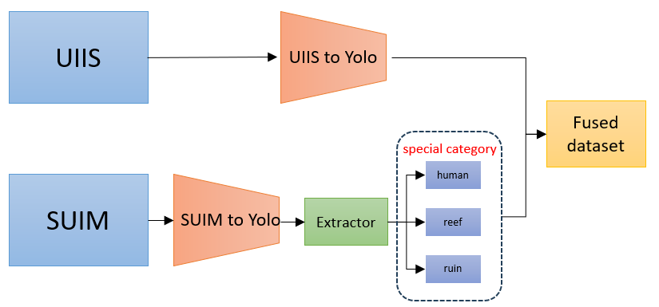

# UnderWater EfficientVIT-SAM Structual

Video Tracking DEMO

**Single-instruction:** This video shows the result of our model segment real-world underwater human diver

[https://github.com/user-attachments/assets/400ba2c1-fa2e-46e6-ac44-b870bc80d0c0](https://github.com/LaiXuanyu/UW_EfficientVIT_SAM/blob/master/demo/seg_video/output_video.mp4)

The structure of the project is as following picture:

The structure of dataset fusion is  as following picture:

